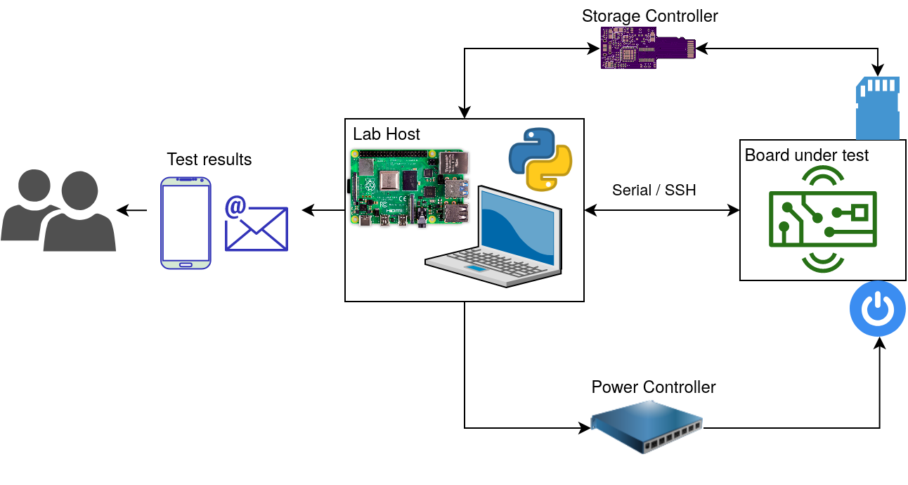

# Pluma Automation Quick Start Guide

## Introduction

Pluma Automation is a tool designed to perform black box testing of embedded hardware; designed to be as lightweight as possible!

At it's core it enables programmatic hardware control of many supported devices to control a board's power, console, storage, and more.
This package is named `pluma.core` (accessible as `pluma` top level package).

On top of the hardware control library sits a testing framework `pluma.test`, which automates the hardware control to run testing of many flavours (regression, soak, feature, etc). This package is entirely optional.
`pluma.core` still works well without it, and can be easily integrated with other testing frameworks and CI/CD tools such as [Pytest](https://docs.pytest.org/) or [Buildbot](https://buildbot.net/).

Finally we have `pluma.utils`, a utilities library to provide additional features such as email reporting or downloading code from `git` repositories.



This guide will aim to give an introduction to the layout of the codebase, and the minimum steps that must be followed in order to start using it.

### Repositories

Pluma Automation is designed in such a way that the core code is able to remain separate from project specific tests, setup etc.

In order to facilitate this, any code that could be reused in any project is found in the repository named [pluma][pluma].

For customer specific modifications, a second repository should be created, following the naming format `farm-<customer>`.

You will likely create one such repository for your project, using it as your working directory, and including content from pluma in order to control hardware, run tests, and more.
Expect to modify your `farm-<customer>` repository frequently, whilst leaving [pluma][pluma] unchanged unless really needed.

### Core codebase (pluma)

Since quick start guide guide is primarily aimed at getting up and running using the code in this repository, the rest of this guide will focus on the core codebase - [pluma](pluma).

The basic structure of [pluma][pluma] is shown below:

```preformatted-text
pluma
├── core                - Hardware control classes
│   ├── ...
│   └── baseclasses     - Bases for types of class
│       └── ...
├── test                - Testing framework
│   ├── ...
│   └── stock           - Generic tests and functions that apply to any project
│       └── ...
├── utils               - Utility functions
│   └── ...
├── cli                 - Command line interface
│   └── ...
├── plugins             - Built-in plugins, such as the core test suite
│   └── ...
├── docs                - Documentation
│   └── ...
├── install.sh          - Installation script
└── ...
```

___

Next: [Install and Run](./2-install-and-run.md) >>

[sphinx]: https://www.sphinx-doc.org
[readthedocs]: https://readthedocs.org
[farm-documentation]: https://bitbucket.org/adeneo-embedded/farm-documentation
[pluma]: https://github.com/Witekio/pluma-automation/